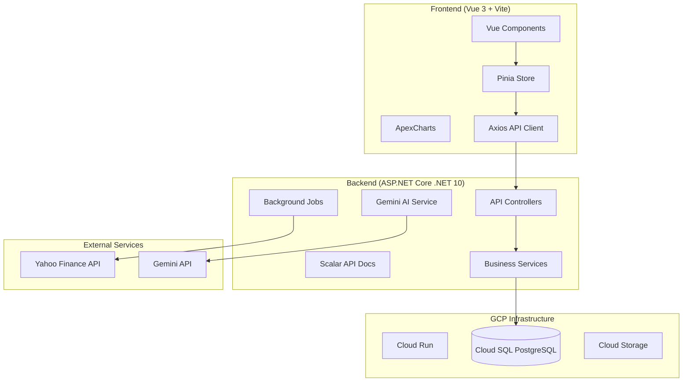
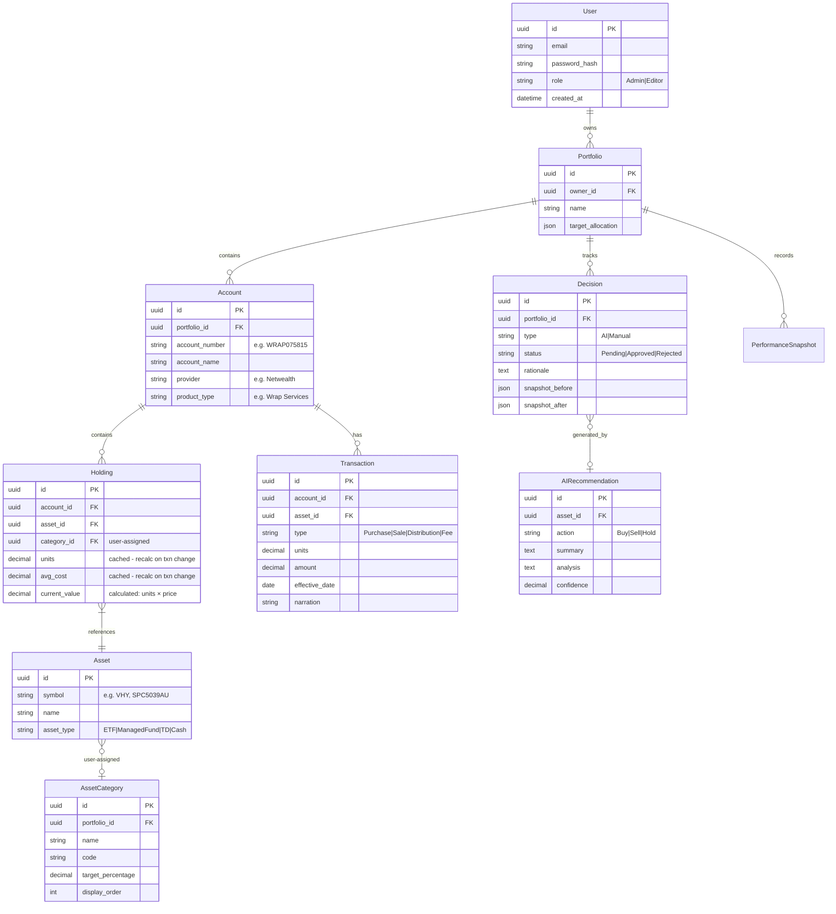
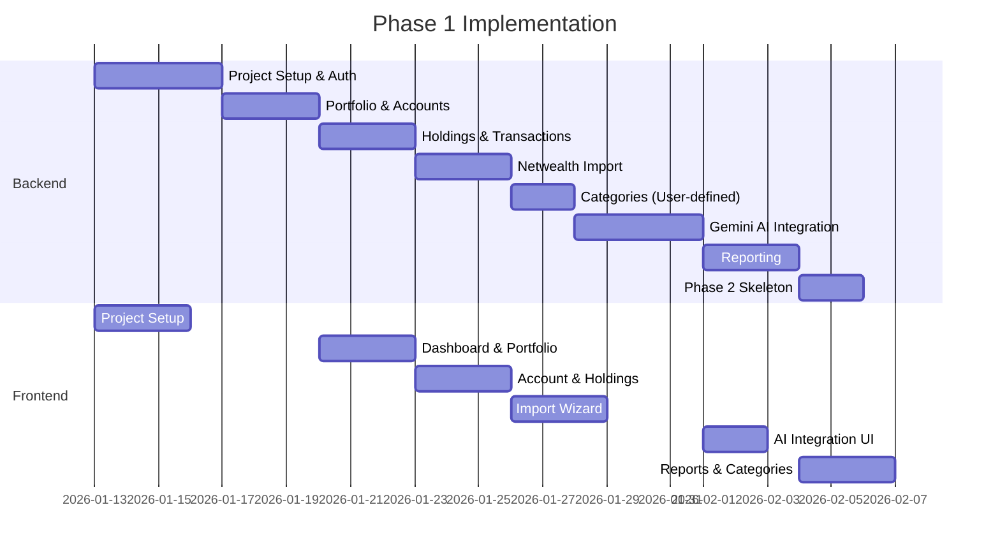

# Financial Planner Application - Implementation Plan

A web-based financial planning application for portfolio tracking, performance analysis, AI-powered recommendations, and decision journaling.

**Stack:** C# ASP.NET Core (.NET 10) | Vue 3 + Vite | PostgreSQL | GCP Hosting | Gemini AI

---

## Architecture Overview



---

## Domain Model

Updated hierarchy: **Owner → Portfolio → Account → Asset**



---

## Data Caching Strategy

Holding values use a **hybrid approach** for optimal performance:

| Field | Strategy | Trigger |
|-------|----------|---------|
| `units` | Cached | Recalculated on transaction insert/update/delete |
| `avg_cost` | Cached | Recalculated on transaction change (weighted average of purchases) |
| `current_value` | Calculated on-demand | `units × current_price` from market data |

This avoids repeatedly summing thousands of transactions on each read while keeping values accurate.

---

## Proposed Changes

### Backend - Controllers

| Controller | Endpoints |
|------------|-----------|
| `AuthController` | Login, Register, Me |
| `PortfoliosController` | CRUD, Performance, Allocation, Rebalance |
| `AccountsController` | CRUD per portfolio |
| `HoldingsController` | CRUD per account, Assign category |
| `DecisionsController` | History, Log manual, Approve/Reject AI |
| `AIController` | Analyze portfolio, Analyze holding, Get recommendations |
| `ImportController` | Upload CSV, Preview, Confirm import |
| `ReportsController` | EOFY, Performance, Tax summary |
| `CategoriesController` | CRUD user-defined categories |

---

### Backend - Services

| Service | Responsibility |
|---------|----------------|
| `GeminiAIService` | Integration with Google Gemini API for recommendations |
| `MarketDataService` | Yahoo Finance API for prices (non-realtime) |
| `NetwealthImportService` | Parse Netwealth PortfolioValuation & TransactionListing CSVs |
| `DecisionTrackingService` | Log decisions, track outcomes |
| `ReportService` | Australian FY calculations (July-June), CGT, franking credits |
| `StressTestingService` | [Phase 2] Monte Carlo, scenario analysis skeleton |

---

### Netwealth CSV Import

Supports two file types from Sample_Data:

**PortfolioValuation** columns:
- Asset, Code, Current units, Avg cost, Price, Value $, Value %, Asset class

**TransactionListing** columns:
- Effective Date, Description, Asset, Code, Units, Debits, Credits, Purchase/Sale price

Import workflow:
1. Upload file → detect file type from headers
2. Parse account metadata (account number, name, provider)
3. Preview holdings/transactions with category assignment UI
4. User assigns categories to assets (persisted for future imports)
5. Confirm → create/update Account, Holdings, Transactions

---

### User-Defined Asset Categories

Users can create custom categories per portfolio. Default templates provided:

| Default Category | Code |
|------------------|------|
| Australian Equities - Large Cap | AU_LARGE |
| Australian Equities - Mid Cap | AU_MID |
| Australian Equities - Small Cap | AU_SMALL |
| Australian Property | AU_PROP |
| International - Large Cap | INT_LARGE |
| International - Mid Cap | INT_MID |
| International - Small Cap | INT_SMALL |
| International - Emerging | INT_EMRG |
| International - Property | INT_PROP |
| International - Commodities | INT_COMM |
| Fixed Interest | FIXED |
| Cash | CASH |

---

### Frontend - Views

| View | Features |
|------|----------|
| `DashboardView` | Portfolio cards, allocation chart (ApexCharts), pending recommendations |
| `PortfolioView` | Accounts list, combined holdings, performance chart |
| `AccountView` | Holdings table, transactions, import history |
| `HoldingDetailView` | Transaction history, AI analysis button, category assignment |
| `DecisionsView` | Timeline, filter by type/status, outcome tracking |
| `ImportView` | Upload wizard, column preview, category mapping |
| `ReportsView` | FY selector, report types, export options |
| `CategoriesView` | Manage custom categories, set targets |
| `SettingsView` | User profile, permissions (Admin only) |

---

### AI Integration - Gemini

```python
# Prompt structure for holding analysis
System: You are a professional investment analyst providing recommendations 
for an Australian investor. Consider CGT implications, franking credits, 
and local market conditions.

User: Analyze this holding:
- Asset: {symbol} ({name})
- Category: {user_category}
- Current allocation: {percentage}%
- Target: {target}%
- Cost base: ${cost_base}
- Current value: ${current_value}
- Holding period: {days} days
- Recent performance: {performance}%

Provide:
1. Action: BUY, SELL, or HOLD
2. Summary (2-3 sentences)
3. Detailed analysis (valuation, market, risk, tax)
4. Confidence (0-100)
```

---

### Phase 2 Skeleton - Stress Testing

Included in Phase 1 codebase as extension points:

| Component | Description |
|-----------|-------------|
| `IStressTestEngine` | Interface for simulation engines |
| `MonteCarloService` | Stub for Monte Carlo simulation |
| `ScenarioService` | Historical scenario modeling (GFC, COVID) |
| `StressTestController` | API endpoints (disabled/preview) |
| `StressTestView.vue` | UI placeholder with "Coming Soon" |

---

## Verification Plan

### Automated Tests
```bash
# Backend
cd Mineplex.FinPlanner.Api && dotnet test

# Frontend
cd fin-planner-ui && npm run test:unit
```

### Manual Verification
1. **Import Flow**: Upload sample Netwealth CSVs, verify parsing
2. **Category Assignment**: Assign custom categories, verify persistence
3. **AI Analysis**: Generate recommendation, approve/reject
4. **EOFY Report**: Generate FY 2024-25, verify July-June range
5. **Multi-account Portfolio**: Create portfolio with 2 accounts

---

## Implementation Timeline


